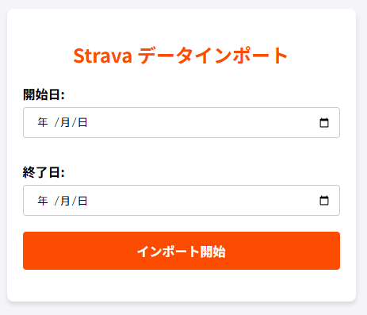

# Strava to Google Calendar Sync (GAS)


Stravaのアクティビティ（トレーニング記録）を自動的に取得し、指定したGoogleカレンダーに予定として登録するGoogle Apps Script (GAS) アプリケーションです。

## 🌟 主な機能

- **Strava API連携**: OAuth2.0を利用して安全にStravaデータへアクセスします。

- **アクティビティの自動登録**: 直近（昨日）のトレーニングデータを取得し、距離、時間、詳細リンクを含めてカレンダーに予定として登録します。

- **スプレッドシートへの登録**: アクティビティのデータをスプレッドシートにも登録します。

- **カレンダー指定**: メインのカレンダーだけでなく、トレーニング専用の特定カレンダーを指定して登録することが可能です。

- **データインポート機能**: ウェブアプリとしてデプロイすることで、画面から任意の期間を指定してデータをまとめてインポートできます。

- **自動デプロイ (CI/CD)**: GitHub Actionsと `clasp` を連携し、`main` ブランチに変更がPushされると自動的にGAS環境へデプロイされます。

## 🚀 環境構築とデプロイ手順

このプロジェクトを自身の環境で動かすための手順です。

### 1. 前提条件

- Googleアカウント

- StravaアカウントおよびAPI設定（クライアントID、シークレットの取得）
  - [Strava Developers](https://developers.strava.com/docs/getting-started/)を参考に、API設定を行い、クライアントIDとシークレットを取得してください。

- [Node.js](https://nodejs.org/) (ローカル開発用)
  - Node.js 24で動作確認しています。

- [pnpm](https://pnpm.io/) (ローカル開発用)
  - pnpm 10で動作確認しています。

### 2. GASプロジェクトの準備

本プロジェクトでは**開発用**と**本番用**の2つのGASプロジェクトを使用します。

#### 2-1. GASプロジェクトの作成

ブラウザで `script.new` にアクセスし、以下の2つのプロジェクトを作成します。

| 環境   | プロジェクト名（例）      | 用途               |
| ------ | ------------------------- | ------------------ |
| 開発用 | `strava-calendar-app-dev` | 動作確認・テスト用 |
| 本番用 | `strava-calendar-app`     | 日常運用で使用     |

#### 2-2. 各プロジェクトの設定

作成した**2つのプロジェクトそれぞれ**に対して、以下を設定します。

1. ライブラリに `OAuth2` を追加します。
   - スクリプトID: `<OAuth2ライブラリのスクリプトID>` （※[Google公式のOAuth2リポジトリ](https://github.com/googleworkspace/apps-script-oauth2)等で公開されているIDをご利用ください）

2. GASの「プロジェクトの設定」>「スクリプト プロパティ」に以下の環境変数を設定します。
   - `STRAVA_CLIENT_ID` : Strava API設定画面で取得したクライアントID
   - `STRAVA_CLIENT_SECRET` : Strava API設定画面で取得したクライアントシークレット
   - `CALENDAR_ID` : 登録先カレンダーのID（未設定の場合はデフォルトのカレンダーになります）
   - `SPREADSHEET_ID` : 登録先スプレッドシートのID（未設定の場合は、スプレッドシートへの登録は行われません）

> **💡 Tips**: 開発用と本番用で異なるカレンダーやスプレッドシートを指定すると、テストデータが本番データに混ざるのを防げます。

### 3. ローカル開発環境のセットアップ

リポジトリをクローンし、Google公式ツールの `clasp` を使ってGASと連携します。

```bash
# リポジトリのクローン
git clone https://github.com/kurousa/strava-calendar-app.git
cd strava-calendar-app

# 依存関係のインストール
# claspも一緒にインストールされます
pnpm install --frozen-lockfile --ignore-scripts

# claspのログイン
clasp login
```

### 4. clasp設定ファイルの準備

各GASプロジェクトの「プロジェクトの設定」からスクリプトIDを確認し、以下の設定ファイルを作成します。

**`.clasp-dev.json`**（開発用）:

```json
{
  "scriptId": "<開発用GASのスクリプトID>",
  "rootDir": "dist"
}
```

**`.clasp-prod.json`**（本番用）:

```json
{
  "scriptId": "<本番用GASのスクリプトID>",
  "rootDir": "dist"
}
```

> **📝 備考**: `.clasp.json` は各スクリプト実行時に動的に生成されるため `.gitignore` で管理対象外にしています。`.clasp-dev.json` と `.clasp-prod.json` はリポジトリで管理されています。

### 5. デプロイ用スクリプト

`pnpm` スクリプトで開発用・本番用を切り替えて操作できます。

| コマンド             | 説明                             |
| -------------------- | -------------------------------- |
| `pnpm run push:dev`  | ビルド → **開発用**GASにプッシュ |
| `pnpm run push:prod` | ビルド → **本番用**GASにプッシュ |
| `pnpm run open:dev`  | **開発用**GASエディタを開く      |
| `pnpm run open:prod` | **本番用**GASエディタを開く      |
| `pnpm run pull:dev`  | **開発用**GASからコードを取得    |
| `pnpm run pull:prod` | **本番用**GASからコードを取得    |

#### 開発の流れ

```
1. コードを修正
2. pnpm run push:dev    ← 開発用GASにデプロイしてテスト
3. 動作確認OK
4. pnpm run push:prod   ← 本番用GASにリリース
```

## 📅 実行方法

### 1. 自動同期

アクティビティを毎日自動的に取得するための設定です。

1. GASエディタの左メニューから「トリガー」（時計アイコン）を選択します。
2. 右下の「トリガーを追加」をクリックします。
3. 以下の設定を行い、保存します。
   - 実行する関数を選択: `main`
   - 実行するデプロイを選択: `Head`
   - イベントのソースを選択: `時間主導型`
   - トリガーのタイプを選択: `日付ベースのタイマー`
   - 時刻を選択: （例：午前6時〜7時）

### 2. リアルタイム同期（Webhook）の設定

Stravaでアクティビティが保存された瞬間にカレンダーへ反映させる設定です。

#### 2-1. ウェブアプリのデプロイ

Webhookの受け口としてGASを公開する必要があります。

1. GASエディタ右上の「デプロイ」>「新しいデプロイ」を選択します。
2. 種類の選択（歯車アイコン）で「ウェブアプリ」を選択します。
3. 設定を以下のように行い、「デプロイ」をクリックします。
   - 説明: （任意）
   - 実行ユーザー: `自分`
   - アクセスできるユーザー: `全員`（※Stravaからの通知を受け取るため「全員」にする必要がありますが、スクリプト内で検証トークンによるチェックを行っています）
4. 発行された「ウェブアプリのURL」をコピーします。

#### 2-2. スクリプトプロパティの設定

1. GASの「プロジェクトの設定」>「スクリプト プロパティ」に以下を追加します。
   - `WEB_APP_URL` : 先ほどコピーした「ウェブアプリのURL」
   - `STRAVA_WEBHOOK_VERIFY_TOKEN` : 任意の文字列（例：`STRAVA`）。Webhookの認証に使用します。

#### 2-3. Webhookの登録実行

1. GASエディタで `main.ts` を開き、関数 `registerStravaWebhook` を選択して実行します。
2. 実行ログに `Webhookを登録しました` と表示されれば成功です。

> **💡 Tips**: 登録状況を確認したい場合は `manageStravaWebhooks` を、解除したい場合は `unregisterStravaWebhook` を実行してください。

### 3. 過去データのインポート



ウェブアプリとしてデプロイすることで、画面から任意の期間を指定してデータをまとめてインポートできます。

#### ウェブアプリのURL

上記「リアルタイム同期」の手順でデプロイしたURLをブラウザで開くことで、インポート画面が表示されます。

#### 手動インポートの実行

1. 表示された画面で「開始日」と「終了日」を選択します。
2. 「インポート開始」ボタンをクリックします。
   - **重複検知**: 既にカレンダーに登録済みのアクティビティ（Stravaの活動URLが詳細欄にあるもの）は自動的にスキップされます。
   - **処理時間**: 数ヶ月以上の長期データを一括取得する場合、処理に数分かかることがあります。

## 🧪 テスト

開発時のテストには Vitest を使用しています。

```bash
# テストの実行
pnpm run test
# カバレッジの確認
pnpm run test:coverage
```

- テスト対象の関数を `*.spec.js` から呼び出すため、各ファイルの末尾で以下のように export してください。

  ```javascript
  if (typeof module !== 'undefined' && module.exports) {
      module.exports = { ... };
  }
  ```

## 📝 ライセンス

MIT License

## 📢 貢献

CONTRIBUTING.md を参照してください。

## 🔗 関連リンク

- [Strava API](https://developers.strava.com/)
- [Google Apps Script](https://developers.google.com/apps-script)
- [clasp](https://github.com/google/clasp)
